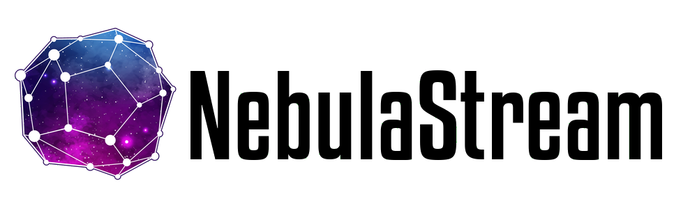

<div align="center">
  <picture>
    <source media="(prefers-color-scheme: light)" srcset="docs/resources/NebulaBanner.png">
    <source media="(prefers-color-scheme: dark)" srcset="docs/resources/NebulaBannerDarkMode.png">
    
  </picture>
  <br />
  <!-- Badges -->
  <a href="https://github.com/nebulastream/nebulastream-public/actions/workflows/nightly.yml">
    
  </a>
  <a href="https://bench.nebula.stream/c-benchmarks/">
    
  </a>
  <a href="https://codecov.io/github/nebulastream/nebulastream" > 
     
  </a>  
</div>

----

NebulaStream is our attempt to develop a general-purpose, end-to-end data management system for the IoT.
It provides an out-of-the-box experience with rich data processing functionalities and a high ease-of-use.

NebulaStream is a joint research project between the DIMA group at TU Berlin and BIFOLD.

Learn more about Nebula Stream at https://www.nebula.stream or take a look at our [documentation](docs).

# Clang-Format, Clang-Tidy, License & Pragma Once Check, and Ensure Correct Comments
We use `clang-format` and `clang-tidy` to ensure code quality and consistency.
To run the checks, you can use the target `format`. 


## Development
NebulaStream targets C++23 using all features implemented in both `libc++` 19 and `libstdc++` 14. All tests are using
`Clang` 19.
Follow the [development guide](docs/development/development.md) to learn how to set up the development environment.
To see our code of conduct, please refer to [CODE_OF_CONDUCT](CODE_OF_CONDUCT.md).

## Build Types
This project supports multiple build types to cater to different stages of development and deployment. Below are the details of each build type:

### Debug
- **Default Logging Level**: All logging messages are compiled.
- **Assert Checks**: Enabled.
- **Use Case**: Ideal for development, providing comprehensive logging and assert checks to help identify and fix issues.

### RelWithDebInfo (Release with Debug Information)
- **Default Logging Level**: Warning.
- **Assert Checks**: Enabled.
- **Use Case**: Balances performance and debugging, including warning-level logging and assert checks for useful debugging information without full logging overhead.

### Release
- **Default Logging Level**: Error.
- **Assert Checks**: Enabled.
- **Use Case**: Optimized for performance, with logging set to error level and assert checks disabled, ensuring only critical issues are logged.

### Benchmark
- **Logging Level**: None.
- **Assert Checks**: Disabled.
- **Use Case**: Designed for maximum performance, omitting all logging and assert checks, including null pointer checks. Suitable for thoroughly tested environments where performance is critical.
- Use this with care, as this is not regularly tested, i.e., Release terminates deterministically if a bug occurs (failed invariant/precondition), whereas Benchmark will be in an undefined state.

## Runtime Docker Image

You can reuse the binaries that were already compiled via `scripts/install-local-docker-environment.sh -l` by packaging the workspace with `Dockerfile.runtime`. The Docker context now includes the `build/` tree, so make sure it contains the artifacts you want to run (for example `cmake -B build -S . && cmake --build build --target nes-single-node-worker`).

1. Build the runtime image (the default `NES_BASE_TAG=local` expects the locally built `nebulastream/nes-development:local` base image):
   ```bash
   docker build -f Dockerfile.runtime -t mobility-nebula:runtime .
   ```
   Use `--build-arg NES_BASE_TAG=<tag>` if you prefer another published base tag.
2. Tag and push the image:
   ```bash
   docker tag mobility-nebula:runtime marianamgarcez/mobility-nebula:runtime
   docker login
   docker push marianamgarcez/mobility-nebula:runtime
   ```

The resulting image contains the full repository under `/opt/mobilitynebula`, exposes every `nes-*` executable from the `build/` directory on `PATH`, and is ready to start with `nes-single-node-worker` by default. Override the container command to run other tools, e.g. `docker run --rm mobility-nebula:runtime nes-nebuli --help`.

### Runtime docker-compose helper

Ship the runtime image together with an automated query registration via Docker Compose:

```bash
docker compose -f docker-compose.runtime.yaml up
```

- `nes-worker` exposes port `8080` to the host and keeps running `nes-single-node-worker`.
- `query-registration` waits for the worker to accept connections and then runs `nes-nebuli -d -s nes-worker:8080 -w register -x -i /workspace/Queries/Query1-csv.yaml`. After the registration finishes the container stops; re-run `docker compose up query-registration` whenever you need to register again.
- The SNCB sample input (`Input/input_sncb.csv`) is part of the image and available at `/workspace/Input/input_sncb.csv`, while Query1-csv writes its output to `/workspace/Output/output_query1.csv` inside the container.
- Override the image via `NES_RUNTIME_IMAGE=myregistry/mobility-nebula:runtime docker compose -f docker-compose.runtime.yaml up` if you have a different tag.
- Defaults for `NES_RUNTIME_IMAGE` and `NES_WORKER_THREADS` live in the project `.env` (auto-loaded by Docker Compose). Override them by exporting env vars before running Compose, e.g. `NES_WORKER_THREADS=4 docker compose -f docker-compose.runtime.yaml up`.
